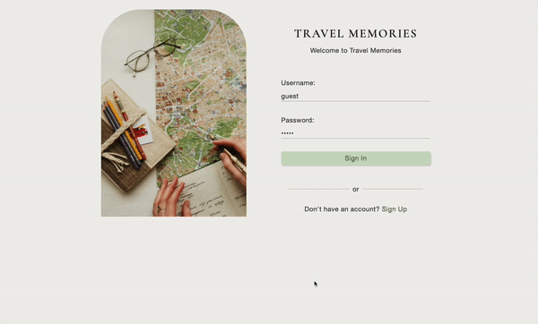

# travel-memories

A full-stack application for people who love to travel and document their memories. This travel diary not only captures your experiences, but also enables you to plot where you've traveled to on a map!

<a href="https://travel-memories-journal.herokuapp.com/">Live Site</a>

## Built with
- HTML and CSS <br/>
- React <br/>
- Node.js <br/>
- Express <br/>
- PostgreSQL <br/>
- Google Maps API (to search Locations and Landmarks from around the world) <br/>
- Mapbox API (to render a map to display all your Travel Memories) <br/>


## Features
- User can submit quiz answers
- User can view recommended recipe
- User can add a recipe to favorites
- User can view favorites
- User can delete a recipe

## Planned Features
- User can sign-up
- User can sign-in

## Getting Started
1. Clone the repo and navigate to the directory
```shell
git clone https://github.com/hnguy96/travel-memories.git
cd travel-memories
```
2. Install all dependencies
 ``` shell
 npm install
 ```

3. Start your PostgreSQL server
```shell
sudo service postgresql start
```

4. Import existing database
```shell
npm run db:import
```

5. Compile project
```shell
npm run dev
```
6. Access application by going to [https://localhost:3000](https://localhost:3000) in the browser

## Preview
<p align="center">
  
</p>
